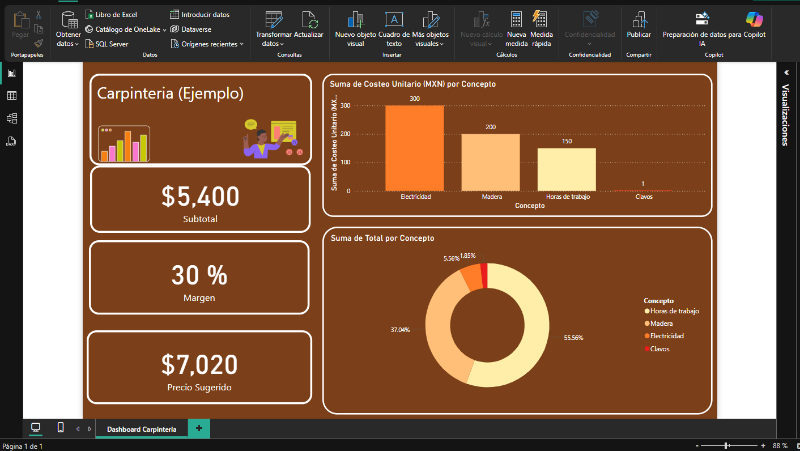

# 📊 Costeo de Proyectos de Carpintería (Python + Excel)

Este script en Python genera automáticamente una plantilla de Excel para calcular el costo total de proyectos de carpintería.

## 游빓 쯈u칠 hace este script?
- Calcula costos por concepto (materiales, mano de obra, energía, etc.)
- Aplica automáticamente un margen de ganancia (editable)
- Exporta todo en formato Excel con formato profesional

Esta herramienta es ideal para talleres que quieren cotizar con precisión y rapidez. Además, puede adaptarse a otros rubros fácilmente.

쯊e interesa una versión adaptada a tu negocio? Estoy listo para ayudarte. 춰Trabajemos juntos!

## 📦 Librerías utilizadas
- `pandas`
- `xlsxwriter`

## 💻 Cómo usarlo
1. Ejecuta el script `costeo_carpinteria.py`
2. Se generará el archivo `plantilla_costeo_carpinteria.xlsx` con los datos calculados

## 💡 Próximos pasos
- Visualización de datos en Power BI
- Versión dinámica con entrada de datos del usuario
- Adaptable a cualquier tipo de negocio.

---

## 📌 Autor
Desarrollado por [Alejandro Arellano Camacho](https://github.com/Alejandroarellanocamacho)
